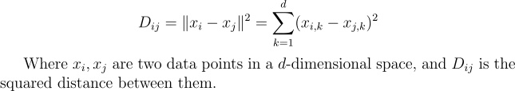
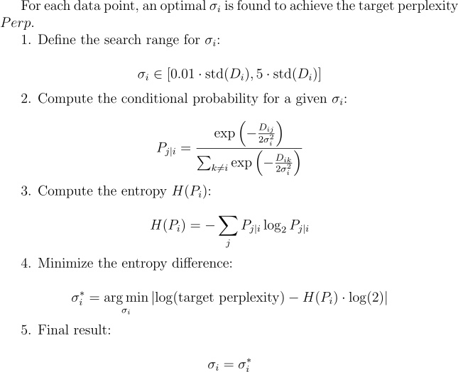
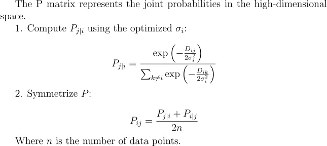
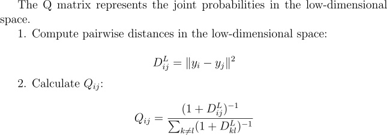
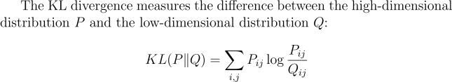
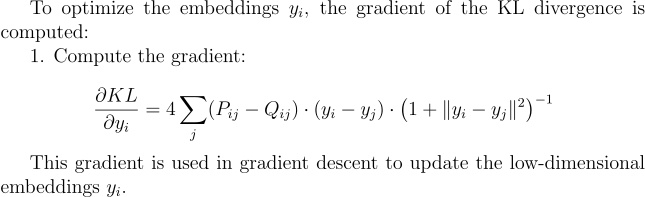

# t-SNE

This project applies t-SNE (t-Distributed Stochastic Neighbor Embedding) to visualize the MNIST dataset. The implementation focuses on reducing the dimensionality of high-dimensional data into a 2D space for better interpretability.

# Mathematics

1. **Calculate Distance Matrix**  
    

2. **Find Sigma**  
    

3. **Calculate P Matrix**  
    

4. **Calculate Q Matrix**  
    

5. **Calculate KL Divergence**  
    

6. **Calculate Gradient**  
    

# Environment

This project is developed using the following setup:

- Python Version: 3.10
- Operating System: Ubuntu 22.04 (Jammy Jellyfish)
- Containerization: Docker

# Usage

To execute the script, run the following command with the desired arguments:

```bash
python tsne_train.py
```

# Config

| Argument              | Type    | Default Value       | Description                                           |
|-----------------------|---------|---------------------|-------------------------------------------------------|
| `sample_size`       | `int`   | `1000`              | Number of MNIST samples to retrieve.                |
| `perplexity`        | `int`   | `30`                | Perplexity parameter for t-SNE.                     |
| `learning_rate`     | `float` | `200.0`             | Learning rate for t-SNE optimization.               |
| `max_iter`          | `int`   | `2000`              | Maximum number of t-SNE iterations.                 |
| `early_exaggeration`| `int`   | `4`                 | Early exaggeration factor for t-SNE.                |

# Result

Results are visualized with two plots:  
1. KL Divergence over iterations to evaluate the optimization process. 
 
2. The final 2D t-SNE visualization of the MNIST dataset with color-coded labels.  
 
