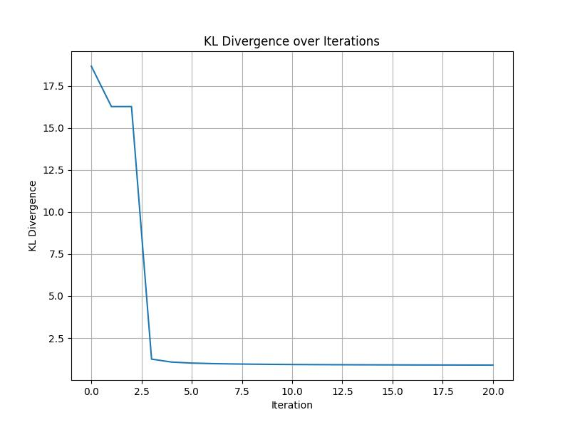
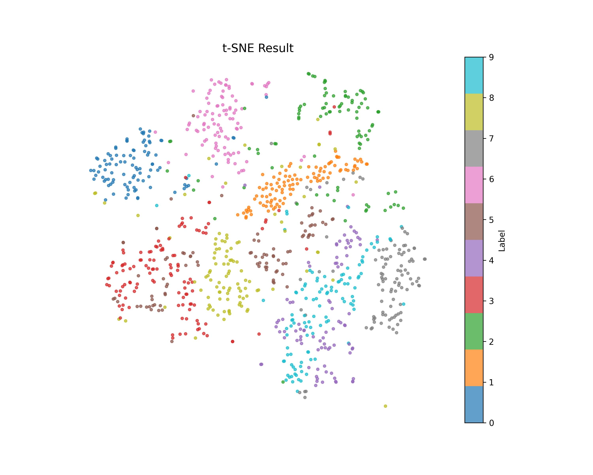

# t-SNE

This project applies t-SNE (t-Distributed Stochastic Neighbor Embedding) to visualize the MNIST dataset. The implementation focuses on reducing the dimensionality of high-dimensional data into a 2D space for better interpretability.

# Mathematics

1. **Calculate Distance Matrix**  
   Compute the pairwise squared Euclidean distances for the input data.  
   
  
   \( D_{ij} = \|x_i - x_j\|^2 = \sum_{k=1}^d (x_{i,k} - x_{j,k})^2 \)  
   
  
   where \(x_i, x_j\) are two data points in a \(d\)-dimensional space, and \(D_{ij}\) represents their squared Euclidean distance.

2. **Find Sigma**  
   Determine the optimal \(\sigma_i\) for each data point to match the desired perplexity \(Perp\).  
   Perplexity is defined as:  
   
  
   \( Perp(P_i) = 2^{H(P_i)} \)  
   
  
   where \(H(P_i)\) is the Shannon entropy of the conditional probabilities:  
   
  
   \( H(P_i) = -\sum_{j} P_{j|i} \log_2 P_{j|i} \)  
   
  
   The conditional probabilities are computed as:  
   
  
   \( P_{j|i} = \frac{\exp\left(-\frac{D_{ij}}{2\sigma_i^2}\right)}{\sum_{k \neq i} \exp\left(-\frac{D_{ik}}{2\sigma_i^2}\right)} \)  
   
  
   Optimize \(\sigma_i\) such that \( \log_2(Perp) = H(P_i) \).

3. **Calculate P Matrix**  
   Construct the symmetric joint probability matrix \(P\):  
   
  
   \( P_{ij} = \frac{P_{j|i} + P_{i|j}}{2n} \)  
   
  
   where \(P_{j|i}\) and \(P_{i|j}\) are the conditional probabilities, and \(n\) is the number of data points.

4. **Calculate Q Matrix**  
   Compute the low-dimensional joint probability matrix \(Q\):  
   
  
   \( Q_{ij} = \frac{(1 + \|y_i - y_j\|^2)^{-1}}{\sum_{k \neq l} (1 + \|y_k - y_l\|^2)^{-1}} \)  
   
  
   where \(y_i\) and \(y_j\) are low-dimensional embeddings, and \(\|y_i - y_j\|^2\) is the squared Euclidean distance in the low-dimensional space.

5. **Calculate KL Divergence**  
   The KL divergence measures the difference between the high-dimensional and low-dimensional distributions:  
   
  
   \( KL(P \| Q) = \sum_{i,j} P_{ij} \log \frac{P_{ij}}{Q_{ij}} \)  
   

6. **Calculate Gradient**  
   Compute the gradient of the KL divergence to update the low-dimensional points:  
   
  
   \( \frac{\partial KL}{\partial y_i} = 4 \sum_{j} (P_{ij} - Q_{ij}) \cdot (y_i - y_j) \cdot \left(1 + \|y_i - y_j\|^2\right)^{-1} \)  
   
  
   This gradient is used in gradient descent to iteratively update the embeddings \(y_i\).

# Result

Results are visualized with two plots:  
1. KL Divergence over iterations to evaluate the optimization process. 
 
2. The final 2D t-SNE visualization of the MNIST dataset with color-coded labels.  
 
